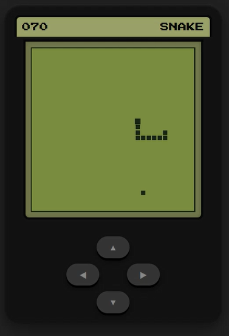

# 🐍 Snake Game JS

A nostalgic recreation of the classic 1997 mobile Snake game, playable directly in your browser!



## ✨ Features

- 📱 Fully responsive - works on mobile and desktop browsers
- 🎯 Classic snake mechanics inspired by the 1997 mobile original
- 🎨 Clean, retro-inspired design
- ⚡ Lightweight and fast performance
- 🕹️ Simple, intuitive controls

## 🚀 Quick Start

### Option 1: Local Play
1. Clone this repository
```bash
git clone https://github.com/IvanDeus/Snake-Game-js.git
```
2. Open `index.html` in your browser
3. Start playing!

### Option 2: Web Server Setup
Place all game files into your web server's public directory. For a quick local server setup, you can use:
![Flask Web Server]https://github.com/IvanDeus/Flask-Web-Server

## 🎯 How to Play

- **Desktop**: Use arrow keys to control the snake
- **Mobile**: Use arrow keys or swipe in the direction you want the snake to move
- Eat the food to grow longer
- Avoid hitting the walls or your own tail
- Try to achieve the highest score!

## 📁 Project Structure

```
Snake-Game-js/
├── index.html          # Main game page
├── snake-game-js.png   # Game screenshot
├── styles.css          # Game styling
└── game.js             # Game logic
```

## 🤝 Contributing

Feel free to fork this project and submit pull requests. You can also open issues for any bugs or feature suggestions.

## 🙏 Acknowledgments

- Inspired by the Snake game on late 90s mobile phones
- Special thanks to the original mobile game developer who brought us hours of entertainment

---

**Enjoy the game!** 🎉 If you like it, don't forget to ⭐ the repository!

2026 [ ivan deus ]
